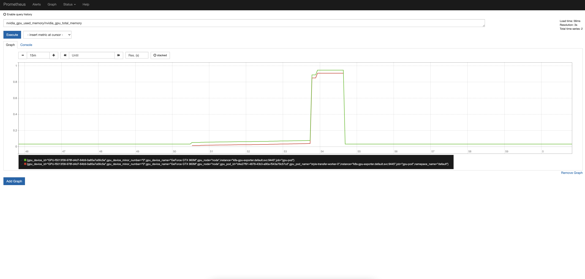

# k8s-gpu-exporter

## Command flags
 - `address` : Address to listen on for web interface and telemetry.
 - `kubeconfig` : Absolute path to the kubeconfig file, default get config from pod binding ServiceAccount.

## Docker Build
1. Find out the `libnvidia-ml.so` on you host.
    ```shell
    find /usr/ -name libnvidia-ml.so 
    ```
    
2. Copy the `libnvidia-ml.so` under `project-dir/lib` directory

3. Run MakeFile
    ```shell
    make docker 
    ```

## Best Practices

If you already have [Arena](https://github.com/kubeflow/arena), use it to submit a training task.
```bash
# First
$ kubectl apply -f k8s-gpu-exporter.yaml

# Second
# """""""""""""""""""""""""""""""""""
# " Then expose this svc at {PORT}  "
# """""""""""""""""""""""""""""""""""

# Third
# submit a deeplearn job
$ arena submit tf --name=style-transfer \
              --gpus=1 \
              --workers=1 \
              --workerImage=registry.cn-hangzhou.aliyuncs.com/tensorflow-samples/neural-style:gpu \
              --workingDir=/neural-style \
              --ps=1 \
              --psImage=registry.cn-hangzhou.aliyuncs.com/tensorflow-samples/style-transfer:ps   \
              "python neural_style.py --styles /neural-style/examples/1-style.jpg --iterations 1000"

# Fourth
$ curl {HOST_IP}:{PORT}/metrics
    
    ...Omit...
    # HELP nvidia_gpu_used_memory Graphics used memory 
    # TYPE nvidia_gpu_used_memory gauge
    nvidia_gpu_used_memory{gpu_node="dev-ms-7c22",gpu_pod_name="",minor_number="0",name="GeForce GTX 1660 SUPER",namepace_name="",uuid="GPU-a1460327-d919-1478-a68f-ef4cbb8515ac"} 3.0769152e+08
    nvidia_gpu_used_memory{gpu_node="dev-ms-7c22",gpu_pod_name="style-transfer-worker-0",minor_number="0",name="GeForce GTX 1660 SUPER",namepace_name="default",uuid="GPU-a1460327-d919-1478-a68f-ef4cbb8515ac"} 8.912896e+07
    ...Omit...

# Fifth
$ kubectl logs {your-k8s-gpu-exporter-pod}
    SystemGetDriverVersion: 450.36.06
    Not specify a config ,use default svc
    :9445
    We have 1 cards
    GPU-0   DeviceGetComputeRunningProcesses: 1
                    pid: 3598, usedMemory: 89128960 
                    node: dev-ms-7c22 pod: style-transfer-worker-0, pid: 3598 usedMemory: 89128960 
```


### Prometheus
##### Scrape_configs
Add k8s-gpu-exporter in prometheus auto discover
```yaml
  prometheus.yml: |
    global:
      scrape_interval:     15s
      evaluation_interval: 15s
    scrape_configs:
    - job_name: 'gpu-pod'
      kubernetes_sd_configs:
      - role: service
      relabel_configs:
      - action: labelmap
        regex: __meta_kubernetes_service_label_(k8s-gpu-exporter)
      - source_labels: [__meta_kubernetes_namespace, __meta_kubernetes_service_name]
        action: keep
        regex: default;k8s-gpu-exporter

```

And you use PromQL query statement `nvidia_gpu_used_memory/nvidia_gpu_total_memory` to see gpu memory usage




